# Emergency Obstetric and Newborn Care - System Design Guide { #rmncah-emonc-design }

## Introduction

The **Emergency Obstetric and Newborn Care (EmONC) Toolkit** for DHIS2 has been developed **in collaboration with UNFPA** to strengthen the collection, analysis, and use of data on maternal and newborn health service readiness and performance.

This toolkit builds upon the **EmONC Light Assessment Tool (LAT)**, a simplified approach for assessing the **availability, readiness, and quality of EmONC services** at health facility level. It operationalizes the LAT framework within DHIS2, providing countries with a standardized, digital configuration to routinely monitor key EmONC indicators and support evidence-based action for improving maternal and newborn outcomes.

The toolkit is aligned with international standards and guidance, including:

- **UNFPA’s EmONC Light Assessment methodology**, which focuses on essential readiness and performance indicators for facilities providing maternal and newborn health services.
- **Global DHIS2 design principles**, emphasizing simplicity, interoperability, and adaptability to national contexts.

The **DHIS2 EmONC Toolkit** includes:

- An **aggregate data model** representing key domains of the EmONC Light Assessment Tool, covering facility readiness, service availability, utilization, and outcomes.
- A set of **core indicators** aligned with UNFPA’s LAT metrics, supporting analysis across the EmONC signal functions and system performance dimensions.
- **Four pre-configured dashboards** for monitoring service readiness, signal functions, utilization and outcomes, and referral system performance.
- **Standardized metadata** and validation rules designed to ensure comparability across facilities, districts, and countries.

This toolkit is optimized to facilitate **routine, cost-effective monitoring** of EmONC services through DHIS2, enabling Ministries of Health and implementing partners to track progress, identify service delivery gaps, measure impact and prioritize quality improvement actions. It complements existing national health information systems by integrating EmONC data within DHIS2’s aggregate reporting framework and supporting interoperability with other MNH and HMIS modules.

The **System Design Guide (SDG)** explains the reference configuration of the DHIS2 EmONC Toolkit, including a detailed description of:

- The **aggregate data model** and data elements corresponding to LAT domains,
- The **indicator definitions** and calculation logic,
- The **dashboard designs** and visualizations, and
- Guidance for **adaptation and customization** within national DHIS2 instances.

This document focuses on the **functional configuration** of the toolkit and does not cover infrastructure, hosting, training, or maintenance considerations, which are addressed in separate implementation resources.

Reference metadata for this toolkit will be made available at: [**dhis2.org/metadata-downloads**](http://dhis2.org/metadata-downloads).

## Acknowledgements

The **EmONC Toolkit** has been developed **in collaboration with UNFPA**. We thank UNFPA for its leadership and technical collaboration in the design and development of this toolkit, as well as for its continued commitment to strengthening maternal and newborn health information systems.

## System Design Overview

### Background

Efforts to reduce maternal and newborn mortality remain central to the global health agenda, yet progress towards the **SDG target of reducing the global maternal mortality ratio to less than 70 per 100,000 live births by 2030** has slowed in many countries. A significant proportion of maternal and newborn deaths continue to occur due to complications that are **largely preventable with timely and quality emergency obstetric and newborn care (EmONC)**.

Monitoring the **availability, readiness, and functionality of EmONC services** is therefore a key priority for Ministries of Health and development partners. However, many countries face challenges in routinely collecting and using reliable EmONC data to guide decision-making. Comprehensive EmONC assessments are often implemented through large-scale surveys that are **resource-intensive and infrequent**, limiting their application to real-time program management.

To address these challenges, **UNFPA introduced the EmONC Light Assessment Tool (LAT)**, a simplified approach designed to streamline data collection on essential EmONC readiness and service provision. The LAT focuses on a **minimum set of tracer indicators** that assess the presence of skilled personnel, key drugs and supplies, functional equipment, and the performance of critical signal functions at health facility level.

Digitizing the LAT within DHIS2 enables countries to transform this periodic assessment into a **routine monitoring mechanism** embedded within existing health information systems. By integrating LAT domains into DHIS2’s aggregate data model, the **EmONC Toolkit** supports regular data entry, analysis, and use at all levels of the health system — from district to national level.

This digital approach provides a **cost-effective and scalable solution** for monitoring EmONC service readiness and utilization, without requiring complex individual-level data systems. It leverages DHIS2’s strengths in **aggregate reporting, data validation, and visualization** to facilitate timely identification of gaps in service readiness, supply availability, and referral system performance.

The EmONC Aggregate Toolkit can be implemented as a **stand-alone module** or integrated into existing DHIS2 national health information systems. It provides a foundation for strengthening data-driven decision-making and aligns with global efforts to improve maternal and newborn survival through **routine, high-quality, and actionable data** on emergency obstetric and newborn care services.

### Use Case

The **EmONC Aggregate Toolkit** is designed to support **routine monitoring of emergency obstetric and newborn care services** across health facilities providing maternal and newborn health care. It enables Ministries of Health and partners to systematically assess and track the **availability, readiness, and performance** of EmONC services as part of ongoing efforts to reduce maternal and newborn morbidity and mortality.

The toolkit facilitates the collection and analysis of a **minimum set of aggregate data elements** derived from the **EmONC Light Assessment Tool (LAT)**. These data elements capture information on key inputs and functions required for quality EmONC service delivery, including:

- Availability of essential **drugs, supplies, and equipment**,
- **Human resource** capacity and presence of skilled providers,
- Functionality of **signal functions** for obstetric and newborn care,
- **Service utilization and outcomes**, including deliveries, complications, and referrals, and
- Readiness of the **infrastructure and referral system** supporting EmONC service delivery.

The system design supports **routine data entry** at health facility level or higher administrative levels (depending on national workflows and reporting practices), enabling consistent monitoring over time. Data are captured through DHIS2 aggregate data sets that mirror the LAT sections, ensuring alignment between paper-based assessment tools and the digital reporting forms.

The aggregate data are then processed through DHIS2 indicators and visualized via **four preconfigured dashboards** that provide actionable insights.

Unlike tracker-based DHIS2 configurations designed for individual-level clinical management, the **EmONC Aggregate Toolkit** is optimized for **facility-level monitoring**. It does not collect identifiable client data but focuses on **aggregated service information** to support programmatic decision-making, supervision, and system performance reviews.

The toolkit can be implemented as a **stand-alone DHIS2 configuration** or integrated into a broader national **Maternal and Newborn Health (MNH) data system** or **Health Management Information System (HMIS)**. By adopting the EmONC Aggregate Toolkit, countries can transition from ad hoc, paper-based assessments to a **standardized, routine, and digital approach** to tracking the readiness and quality of emergency obstetric and newborn care services.

#### Intended users

The **EmONC Aggregate Toolkit** is designed to meet the needs of **programme managers, health information officers, and technical teams** responsible for monitoring and improving maternal and newborn health services at all levels of the health system. The toolkit supports both **data entry and data use** functions, ensuring that information on service readiness, availability, and quality is routinely captured, analyzed, and acted upon.

Intended users may include:

- **Maternal and Newborn Health (MNH) and EmONC programme managers (national and sub-national)**:  
    Data users responsible for reviewing and interpreting EmONC indicators to monitor performance, identify gaps in service delivery, and guide planning and resource allocation. They use the EmONC dashboards for evidence-based decision-making, supervision, and performance review.
- **Health Management Information System (HMIS) and Monitoring & Evaluation (M&E) officers**:  
    Users who oversee data collection, aggregation, validation, and reporting processes for EmONC indicators within the national health information system. They ensure data quality, completeness, and consistency across reporting facilities and coordinate feedback mechanisms to improve routine reporting.
- **System administrators and DHIS2 focal points**:  
    Technical users responsible for configuring, maintaining, and adapting the EmONC module within DHIS2. They manage user roles and permissions, update metadata, ensure alignment with other DHIS2 health domains, and provide support and troubleshooting for end users.
- **Facility-level staff and supervisors**:  
    Health workers or supervisors at facilities who report EmONC data on a quarterly or biannual basis using DHIS2 aggregate data sets. Depending on the national workflow, data may be entered directly into DHIS2 or consolidated from paper-based forms reflecting the EmONC Light Assessment Tool.
- **Implementing and technical partners**:  
    Organizations supporting Ministries of Health in EmONC and MNH programme implementation, digital health, or data systems strengthening. These partners may provide capacity building, facilitate system adaptation and rollout, and support data analysis and use for programme improvement.

### Design structure

The **DHIS2 EmONC Aggregate Toolkit** is composed of two main components that together enable comprehensive monitoring of emergency obstetric and newborn care (EmONC) service readiness and performance:

1.  **Dashboards and Indicators** 
    The toolkit includes **four dashboards**, organized into two major groups according to their intended level of use:
    - **Health Facility Dashboards**
        These dashboards are accessible to health facilities according to the level of EmONC services they provide. Each presents relevant indicators derived from the EmONC Light Assessment Tool (LAT) and supports facility-level monitoring, supervision, and quality improvement.
        1.  **BEmONC Dashboard:** For facilities providing **Basic Emergency Obstetric and Newborn Care**, focusing on the availability and functionality of essential drugs, supplies, equipment, human resources, and basic signal functions.
        2.  **CEmONC Dashboard:** For facilities providing **Comprehensive Emergency Obstetric and Newborn Care**, including surgical and blood transfusion capacity, with corresponding readiness and performance indicators.
        3.  **IEmONC Dashboard:** For **Intermediate or referral-level facilities** that offer advanced maternal and newborn care beyond comprehensive level, focusing on specialized services and system performance.
    - **B. Subnational and National Dashboard** 
        This dashboard is designed for **district, regional, and national programme managers**. It aggregates data across facilities and administrative units to provide an overview of system readiness, utilization, outcomes, and referral performance. It supports strategic planning, prioritization of resources, and monitoring of EmONC coverage and quality across the national network of facilities.  
        All dashboards are powered by **core indicators** aligned with the **EmONC Light Assessment Tool (LAT)** domains. Indicators are grouped by thematic area—readiness, signal functions, utilization and outcomes, and referral systems—to support targeted analysis and data-driven decision-making at each level of the health system.  
        
2.  **Aggregate Data Set**
    The configuration includes a **single aggregate data set – the EmONC Light Assessment Tool (LAT)** – which mirrors the structure and content of the UNFPA LAT instrument. This dataset captures all the key domains for EmONC monitoring, including:  
    - Facility readiness and availability of drugs, supplies, equipment, and infrastructure
    - Deliveries, maternal and newborn complications, and outcomes
    - Performance of signal functions
    - Referral systems and service integration

The LAT dataset is designed for **periodic reporting** (typically **quarterly or biannual**) and can be completed directly in DHIS2 or used to digitize paper-based LAT forms. It serves as the foundation for all dashboards and indicators, enabling consistent monitoring and analysis across facility, subnational, and national levels.

## Dataset

### Dataset structure

#### Identification

The Identification section is used to define the context of the EmONC assessment and to ensure that data entered into the EmONC Light Assessment Tool (LAT) dataset are correctly linked to the facility and reporting period.

This section includes two core data elements:

- Date of data collection
- Type of EmONC: Coded option set (BEmONC / CEmONC / IEmONC)

The **Type of EmONC** field is critical for enabling context-specific validation and analysis. Once the type is selected, DHIS2 automatically triggers a set of **validation rules** to ensure data consistency and completeness. These rules verify that key **drugs and supplies**, **materials and equipment**, and **human resources** required for the selected EmONC level have been reported.

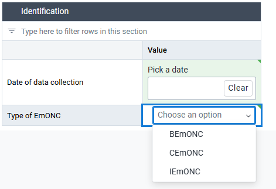

This design ensures data integrity and alignment with the EmONC classification framework, allowing appropriate aggregation and analysis across facilities according to their designated level of care.

#### Key EmONC Drugs and Supplies

The **Key EmONC Drugs and Supplies** section captures the availability of essential commodities required to perform EmONC signal functions safely and effectively. It serves as a proxy for **facility readiness** and is aligned with the core list of tracer commodities included in the **EmONC Light Assessment Tool (LAT)**.

Each data element is reported as a **binary variable** indicating whether the commodity was **continuously available with no stockouts during the reporting period**.

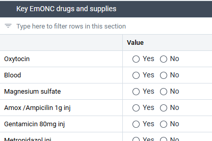

**Validation rules** linked to this section depend on the **Type of EmONC** selected in the _Identification_ section:

- **BEmONC:** Must report availability for all core maternal drugs and basic newborn commodities.
- **CEmONC:** Must also report on blood and transfusion-related supplies.
- **IEmONC:** Must meet all CEmONC requirements

These validation rules help ensure internal consistency, identify readiness gaps, and support targeted supervision and corrective action.

#### Key EmONC materials and equipments

The **Key EmONC Materials and Equipment** section captures the availability and functionality of the essential tools and instruments required to provide emergency obstetric and newborn care. Availability of functional equipment is one of the core components of EmONC readiness and is directly linked to the facility’s ability to perform the required signal functions.

Each item must be reported as available (“Yes”) only if it was **functional and in use throughout the reporting period**. Any period of non-functionality, repair, or absence should result in a “No” value.

All facilities, regardless of their EmONC level, are expected to report on the availability of the **basic set of materials and equipment** necessary for the provision of delivery and newborn care services. These include essential items such as **MVA kits**, **delivery instrument sets**, **autoclaves or sterilizers**, **blood pressure apparatus**, **oxygen source**, **suction device for newborns**, **fetal doppler or Pinard stethoscope**, **radiant warmer or heat source**, and **bag and mask for neonatal resuscitation**.

In addition to these core items, **facilities classified as CEmONC or IEmONC** are required to report on a set of **advanced equipment** used for surgical and newborn intensive care. These additional items include:

- **Complete cesarean section boxes/instruments**, ensuring the availability of sterile surgical sets for obstetric surgery.
- **Bubble CPAP with blender**, for respiratory support of newborns with breathing difficulties.
- **Incubator**, to provide controlled thermal regulation for preterm and ill newborns.  
    **Number of functioning beds for newborns**, representing the total number of operational newborn cots or warmers available.
- **Phototherapy device**, used for the management of neonatal jaundice.

**Validation rules** applied to this section ensure that:

- Facilities designated as **CEmONC** or **IEmONC** report availability for all listed equipment, including advanced items.
- Facilities designated as **BEmONC** report only the basic readiness items and are not required to complete fields related to surgical or advanced newborn care equipment.

This conditional logic maintains data integrity, ensures accurate classification of facility readiness, and supports meaningful analysis of EmONC capacity by level of care.

#### Key HR for EmONC

The **Key Human Resources for EmONC** section records the availability of qualified personnel required to deliver emergency obstetric and newborn care. Human resources are a central component of EmONC readiness, as the presence of appropriately trained staff determines whether a facility can perform essential and comprehensive signal functions.

All data elements in this section are reported as **numeric values**, representing the number of staff members **available and providing EmONC services** during the reporting period. Only active staff assigned to EmONC-related duties should be included; trainees, volunteers, or staff not participating in service delivery are excluded.

All EmONC facilities — including BEmONC, CEmONC, and IEmONC — are expected to report on the **core human resources** required for the provision of basic obstetric and newborn care. These typically include:

- **Midwives providing delivery care**,
- **Nurses providing maternity or newborn care**,
- **Laboratory technicians**, and
- **Ambulance drivers or emergency transport personnel**.

In addition to these core staff, **CEmONC and IEmONC facilities** are expected to report on the availability of **specialized clinical personnel** required for surgical and advanced obstetric and newborn care. These additional categories include:

- **Obstetricians/gynecologists**, responsible for performing cesarean sections and managing complex obstetric cases.
- **Pediatricians or neonatologists**, providing specialized care for newborns, especially those with complications or preterm births.
- **Anesthesiologists or anesthetic providers**, responsible for administering anesthesia during cesarean sections and other surgical procedures.
- **Surgeons**, where applicable, providing general or obstetric surgery in facilities offering comprehensive services.
- **Medical doctors with surgical skills**, providing cesarean sections or other life-saving procedures in settings where specialized surgeons may not be available.

**Validation rules** linked to this section ensure that:

- **CEmONC and IEmONC** facilities report on all advanced categories listed above, in addition to the core staff required at all levels.
- **BEmONC** facilities are not expected to report on specialized medical or surgical staff.

This approach ensures that data on staffing are appropriately aligned with the **type of EmONC services provided**, allowing programme managers to assess readiness, identify gaps in workforce allocation, and plan for capacity strengthening where needed.

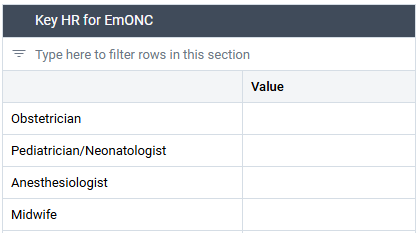

#### Basic infrastructure

The Basic Infrastructure section captures information on the essential facility-level systems that enable the safe and continuous provision of EmONC services. Reliable infrastructure is fundamental to the functionality of maternity and newborn units, as it ensures that critical services can be provided at any time, particularly in emergency situations.

Each element in this section is recorded as a binary variable (Yes = 1, No = 0), indicating whether the specified infrastructure component was functional and available throughout the reporting period.

Facilities are required to report on the following components:

- Running water: Continuous access to clean running water within the facility, available for both clinical and non-clinical use.
- Electricity: Uninterrupted power supply from a main grid or generator to ensure safe operation of equipment and lighting.
- Means of communication: Access to a functioning communication device, such as a mobile phone or landline, for coordinating emergencies, referrals, or logistics.
- Functioning laboratory: Availability of an operational laboratory capable of conducting essential tests to support EmONC services (e.g., hemoglobin, blood grouping, cross-matching).
- Blood bank: Existence of an on-site blood bank or formal access to a nearby functional transfusion service.
- Functioning ambulance: Availability of a reliable and functional ambulance (or other designated emergency transport vehicle) for referral and emergency transfers.

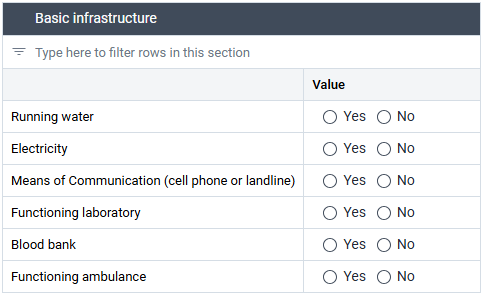

#### Health Statistics – Deliveries & Births

The Health Statistics – Deliveries & Births section captures data on delivery outcomes, birth types, and newborn admissions, providing key metrics for assessing service utilization and outcomes within EmONC facilities. This section contributes to evaluating both the volume of services provided and the quality and safety of obstetric and newborn care.

All data elements are reported as numeric counts representing the number of cases recorded during the reporting period.

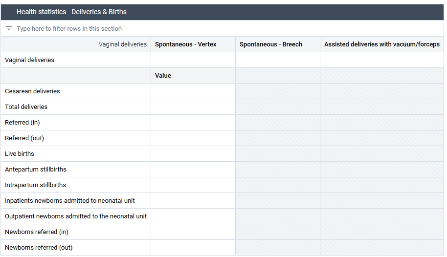

#### Health statistics - Mothers: Direct obstetric complications

The **Health Statistics – Mothers: Direct Obstetric Complications** section captures data on the **major direct causes of maternal morbidity and mortality**, providing key information on the capacity of facilities to identify, manage, and refer obstetric complications.  
These data are critical for assessing both **service performance** and the **quality of emergency response** in EmONC facilities.

Each data element in this section is reported as a **numeric value**, representing the number of women who experienced each type of complication **and received treatment or referral** during the reporting period.

Facilities are required to report on the following conditions:

- **Antepartum hemorrhage:** Number of women managed for vaginal bleeding during pregnancy, before the onset of labour.
- **Postpartum hemorrhage:** Number of women treated for excessive bleeding after delivery, including cases requiring uterotonic drugs, transfusion, or surgical intervention.
- **Uterine rupture:** Number of women diagnosed and managed for uterine rupture, whether treated surgically or referred.
- **Pre-eclampsia/eclampsia:** Number of women treated for severe pre-eclampsia or eclampsia, including those who received magnesium sulfate and/or antihypertensives.
- **Severe postpartum infection:** Number of women treated for sepsis or severe infection following delivery or abortion.
- **Prolonged/obstructed labour:** Number of cases where delivery was delayed or obstructed, requiring assisted delivery, cesarean section, or referral.
- **Complications of abortion:** Number of women managed for abortion-related complications, including incomplete, septic, or unsafe abortion cases.
- **Other direct obstetric complications:** Any other life-threatening maternal complications directly related to pregnancy or delivery not captured in the categories above (e.g., retained placenta, amniotic embolism).

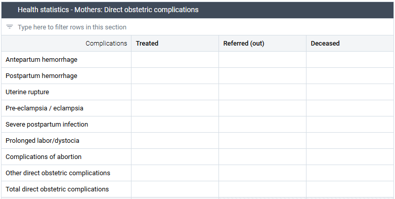

#### Health statistics - Mothers: Indirect complications

The **Health Statistics – Mothers: Indirect Complications** section captures data on **pregnancy-related complications not directly caused by obstetric conditions**, but which significantly affect maternal health and outcomes. These include conditions that are pre-existing or aggravated by pregnancy and childbirth.

This section complements the reporting on direct obstetric complications by providing insight into the broader maternal morbidity profile within EmONC facilities.

Each data element is reported as a **numeric count**, representing the number of women with **indirect obstetric complications** who were either **treated**, **referred**, or **deceased** during the reporting period.

Facilities are required to report on:

- **Indirect obstetric complications – treated:** Number of women who received care for indirect complications such as severe anemia, malaria, cardiac disease, diabetes, or other chronic conditions affecting pregnancy outcomes.
- **Indirect obstetric complications – referred (out):** Number of women referred to another facility for management of indirect conditions beyond the capacity of the reporting facility.
- **Indirect obstetric complications – deceased:** Number of women who died as a result of indirect obstetric causes, such as pre-existing medical conditions worsened by pregnancy.

Data from this section are used to complement analyses of maternal mortality and morbidity, supporting the identification of systemic weaknesses in the management of chronic or non-obstetric conditions that complicate pregnancy and childbirth.

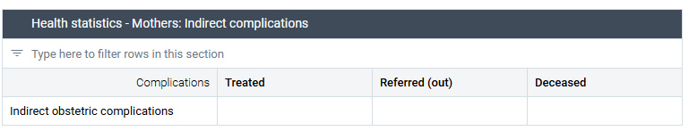

#### Health statistics - Mothers: Unknown causes of maternal deaths

The **Health Statistics – Mothers: Unknown Causes of Maternal Deaths** section captures cases of maternal deaths for which the cause could not be determined or classified at the time of reporting. This section provides an important completeness check for maternal mortality data and helps to identify areas where **clinical documentation, case review, or cause-of-death certification** require strengthening.

Facilities are required to report the **number of maternal deaths with unknown cause** that occurred during the reporting period. Each record represents a **numeric count** of deaths for which insufficient information was available to assign a cause under either **direct** or **indirect obstetric complications**.

Facilities should use this field only when:

- Clinical records are incomplete or unavailable;
- The woman died before diagnosis or referral; or
- The case was not reviewed through a maternal death audit process at the time of reporting.

This section helps identify data quality issues in mortality reporting and guides targeted follow-up for case investigation, audit, or documentation improvement.

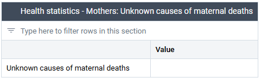

#### Health statistics - Newborns

The **Health Statistics – Newborns** section captures data on **newborn complications, treatments, referrals, and deaths** within the reporting period. These data are essential for understanding the burden of neonatal conditions, assessing the performance of newborn care services, and identifying areas requiring improvement in clinical management and referral systems.

Each complication type is reported in three categories:

- **Treated:** Number of newborns managed for the specific condition within the facility.
- **Referred (out):** Number of newborns referred to another facility for advanced care.
- **Deceased:** Number of newborns who died due to the specified condition during the reporting period.

Facilities are required to report on the following conditions:

- **Neonatal asphyxia:** Number of newborns diagnosed and treated for birth asphyxia, including those resuscitated with bag and mask or CPAP.
- **Neonatal infection:** Number of newborns treated for infection or suspected sepsis, including antibiotic treatment.
- **Low birth weight (<2500g):** Number of newborns weighing less than 2500 grams at birth, including those treated for complications related to prematurity or growth restriction.
- **Small and sick newborn:** Number of newborns requiring special or intensive care due to complications such as prematurity, respiratory distress, or hypothermia.
- **Neonatal death during first 24 hours of newborn with ≥2500g:** Number of newborns weighing 2500 grams or more who died within the first 24 hours of life, indicating possible quality-of-care or intrapartum complications.  
    **Neonatal death before discharge:** Number of newborns who died after 24 hours but before discharge from the facility.
- **Fresh stillbirth with ≥2500g:** Number of stillbirths of babies weighing 2500 grams or more at birth, presumed to have occurred intrapartum (“fresh” stillbirths).

All data are reported as **numeric counts**, representing events during the reporting period.

This section supports analysis of newborn morbidity and mortality patterns, helps identify quality-of-care gaps at the facility level, and contributes to continuous monitoring of neonatal outcomes within the EmONC network.

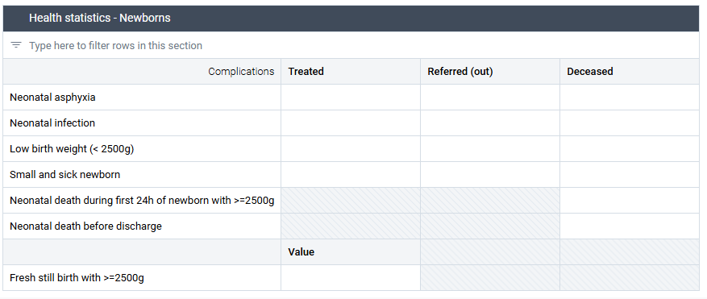

#### Performance of signal functions - Obstetric

The **Performance of Signal Functions – Obstetric** section captures information on whether key obstetric signal functions were performed during the reporting period and, when not performed, identifies the underlying reasons. These data are essential for assessing the functional readiness of facilities to provide life-saving interventions for maternal emergencies.

For each signal function, users must select one of the following options:

- **Yes:** The function was performed during the reporting period.
- **No – Lack of availability of necessary health workers:** Not performed because qualified staff were not available.
- **No – Training issues:** Not performed because providers were available but not trained or lacked confidence in performing the procedure.
- **No – Supplies/equipment issues:** Not performed due to missing or non-functional supplies or equipment.
- **No – Policy issues:** Not performed because national or facility policies restrict the procedure.
- **No – Management issues:** Not performed due to organizational barriers, lack of supervision, or provider reluctance unrelated to training.  
    **No – No indication:** Not performed because no case requiring the intervention presented during the reporting period.

Each response provides critical insight into whether the facility is **functionally capable of providing emergency obstetric care** or constrained by human resource, supply, or policy-related barriers. This information helps identify specific areas for support, supervision, or system strengthening to ensure that emergency interventions can be performed when needed.

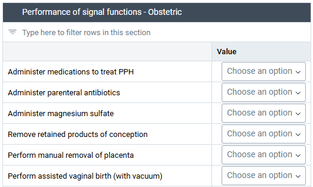

#### Performance of signal functions - Newborn

The **Performance of Signal Functions – Newborn** section records whether essential newborn care functions were performed during the reporting period and, if not, the reasons for non-performance. The same list of response options applies as in the _Performance of Signal Functions – Obstetric_ section.

This section provides insight into the facility’s capacity to manage life-threatening newborn conditions and to ensure quality care immediately after birth.

Each signal function represents a core capability for newborn survival and care. Monitoring their performance helps identify service delivery bottlenecks and areas requiring targeted support in training, supply availability, or service organization.

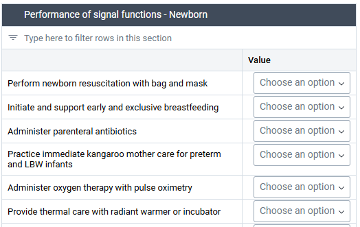

#### Performance of signal functions - Referral

The **Performance of Signal Functions – Referral** section captures whether the facility was able to arrange an appropriate referral for clients requiring care beyond its capacity. It focuses on the functionality of the referral system as a critical component of the EmONC continuum of care.

The same list of response options applies as in the _Performance of Signal Functions – Obstetric_ section.

This section includes one key function:

- **Arrange ambulances, with trained and equipped providers, to a facility that can provide definitive care.**

This indicator assesses whether the facility can mobilize a functioning ambulance, staffed and equipped for emergency transfer, and ensure that referred patients are directed to a higher-level facility capable of delivering the required care.

Monitoring this function helps determine whether referral pathways are operational, safe, and timely, and identifies gaps related to transport availability, staffing, or coordination that may delay emergency care.

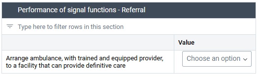

#### Provision of other MNH services

The **Provision of Other MNH Services** section captures additional elements of maternal and newborn health (MNH) service delivery that complement the EmONC signal functions. These items reflect the broader quality and continuity of care provided to women and newborns during labour, delivery, and the immediate postnatal period.

The same list of response options applies as in the _Performance of Signal Functions – Obstetric_ section.

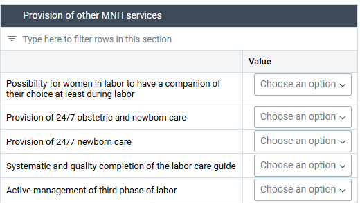

#### Quality of referral

The **Quality of Referral** section assesses how effectively the referral system functions for mothers and newborns who require care beyond the capacity of the reporting facility. It evaluates not only the presence of referral mechanisms but also their operational quality, accessibility, and consistency in documentation.

This section includes the following elements:

- **Effectiveness of referral and coordination of care:** Assesses whether clear communication and coordination exist between referring and receiving facilities to ensure timely and appropriate management of referred cases.
- **Financial accessibility of referral:** Determines whether referral services, including transportation and care at higher-level facilities, are affordable and accessible to patients without creating financial barriers.
- **Systematic use of referral forms during mothers’ and newborns’ referrals:** Verifies whether standardized referral forms are consistently used and properly completed for all referred cases, ensuring documentation continuity and traceability of care.

These indicators help evaluate the functionality and equity of the referral system, identifying gaps in communication, financial access, and documentation that can delay or compromise emergency care for women and newborns.

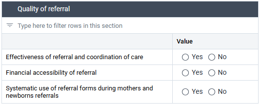

## EMONC dashboards

### Health facility dashboards

For health facility supervisors and other end users interested in facility-specific data, three types of dashboards are provided, specific to BEmONC, CEmONC, and IEmONC facilities. Each of these dashboards provides nine visualizations of key indicators related to the provision of EmONC. The illustrative visualizations provided here are from the BEmONC level.

The nine visualizations together provide health facility supervisors with a comprehensive understanding of their facility’s capacity to deliver high-quality EmONC and to identify targeted areas for improvement. The first set of visualizations assesses readiness by tracking the availability of essential drugs, supplies, equipment, and infrastructure—core components that determine whether a facility can provide timely and effective care. A signal function visualization then translates these readiness indicators into functional performance, showing whether the facility is fully meeting expectations for its EmONC designation (BEmONC, CEmONC, or IEmONC) and highlighting specific functions requiring attention or additional support. Finally, the maternal and perinatal case fatality rate visualizations provide outcome-based measures that allow supervisors to link service readiness and functionality with the quality of clinical care. Taken together, these visualizations help supervisors identify gaps, prioritize resources, plan quality improvement interventions, and monitor progress toward ensuring comprehensive and effective EmONC service delivery within their facilities.

Six visualizations provide information on facility readiness to provide basic, comprehensive, or intensive EmONC, depending on its classification. The first two visualizations describe the availability of essential drugs and supplies. The table lists specific drugs and supplies, indicating their availability numerically (0 = not available, 1 = available). The gauge visualization indicates the percent of required drugs and supplies that are available. At the BEmONC level, as illustrated below, 14 items are expected to be available.

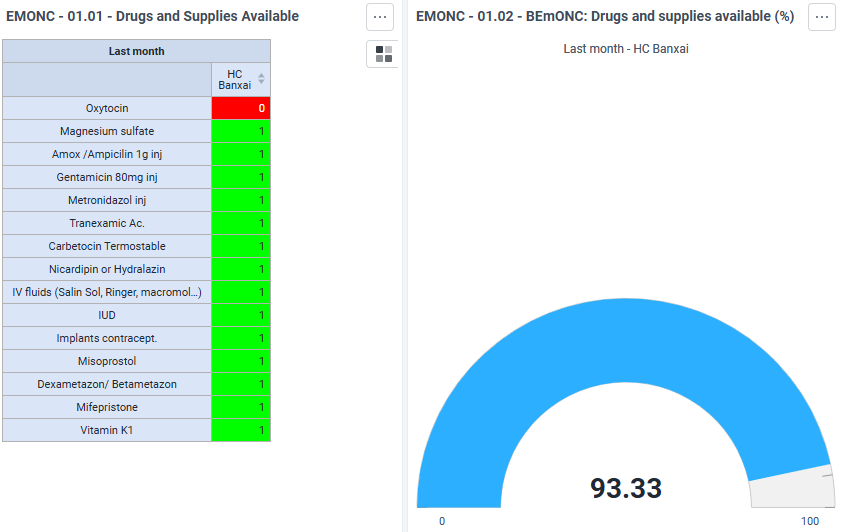

The next two visualizations describe the availability of essential materials and equipment. The table lists specific items, indicating their availability numerically (0 = not available, 1 = available). The gauge visualization indicates the percent of required materials and equipment that are available. At the BEmONC level, as illustrated below, 19 items are expected.

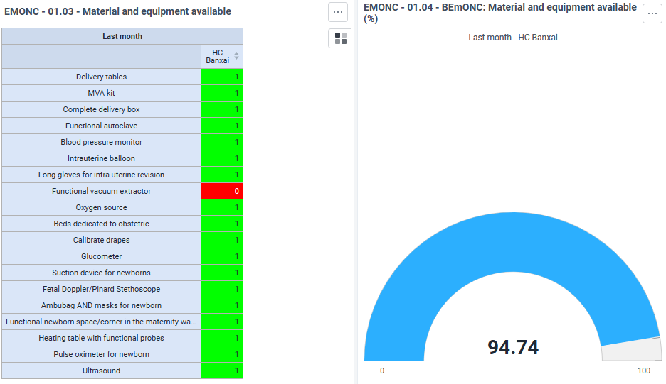

The final two visualizations describing facility readiness note the availability of essential infrastructure. The table lists five essential aspects of infrastructure, indicating their availability numerically (0 = not available, 1 = available). The gauge visualization indicates the percent of required infrastructure elements that are available. At the BEmONC level, as illustrated below, five elements of infrastructure are expected to be available. All elements must be available for a facility to provide EmONC.

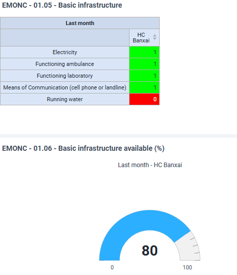

The next visualization describes whether the facility is functioning as an effective EmONC facility, based on whether the Light Assessment Tool found that it provided all the signal functions for its level (BEmONC, CEmONC, or IEmONC) in the past three months. While a facility should have provided all the signal functions appropriate for its designation, many will have provided all but one or all but two. Therefore, the visualization also includes target lines for EmONC-1 and EmONC-2. Understanding the level of signal function provision is helpful for facility supervisors to identify priorities for and target improvements in facility readiness and provider skills to deliver all components of EmONC.

The final two visualizations document maternal and perinatal outcomes, providing case fatality rates from direct obstetric complications and perinatal complications in the past four quarters.

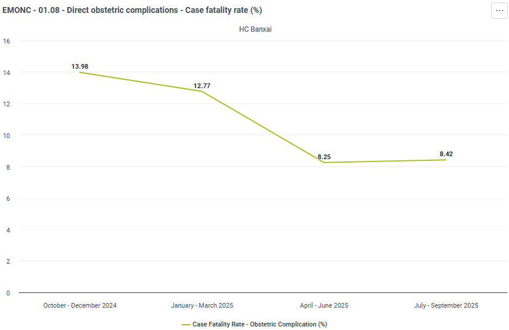

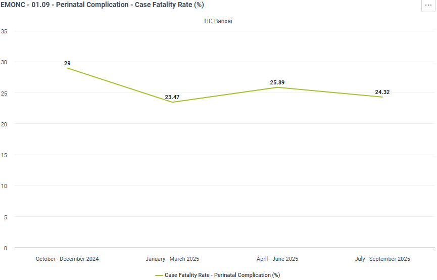

When interpreted alongside data on EmONC readiness and signal function provision, these visualizations enables supervisors to link service capacity with outcomes and identify where targeted interventions—such as refresher training, equipment procurement, or improved newborn resuscitation protocols—could strengthen the quality of care and reduce preventable maternal and perinatal deaths.

### Subnational/National dashboard

The Subnational/National Dashboard aggregates information from all BEmONC, CEmONC, and IEmONC facilities in the selected geographic area, providing higher level users (such as district provincial, and national programme managers) with an overview of system readiness, utilization, outcomes, and referral performance. The visualizations in this dashboard support strategic planning, prioritization of resources, and monitoring of EmONC coverage and quality across the national network of facilities.

The first six visualizations provide a snapshot of facility readiness to provide EmONC across levels. The three charts indicate the percent of BEmONC, CEmONC, and IEmONC facilities that have all essential drugs and supplies, materials and equipment, and elements of essential infrastructure required to provide EmONC.

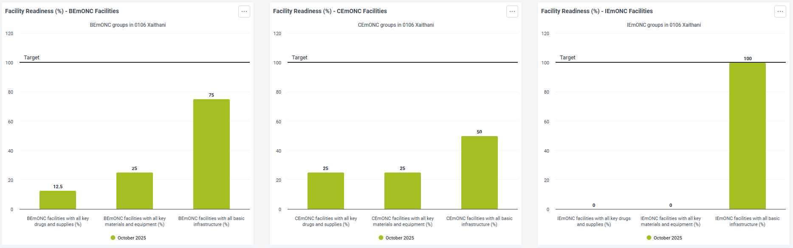

The accompanying three tables indicate how many BEmONC, CEmONC, and IEmoNC facilities in the selected subnational or national areas have all all essential drugs and supplies, materials and equipment, and elements of essential infrastructure required to provide EmONC.

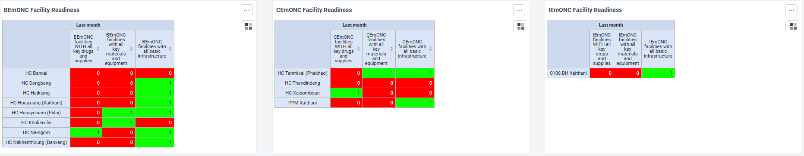

The last three visualizations describe the proportion of facilities functioning as an effective EmONC facility, based on whether the Light Assessment Tool found that it provided all the signal functions for its level (BEmONC, CEmONC, or IEmONC) in the past three months. While a facility should have provided all the signal functions appropriate for its designation, many will have provided all but one or all but two. Therefore, the visualizations also visualize the proportion of facilities that provide EmONC-1, EmONC-2 and the ones that are not providing effective EmONC.

## User groups

| **User group** | **Metadata** | **Data** |
| --- | --- | --- |
| EmONC - Admin | Can edit and view | No Access |
| EmONC - Access | Can view only | Can view only |
| EmONC - Data capture | Can view only | Can capture and view |
